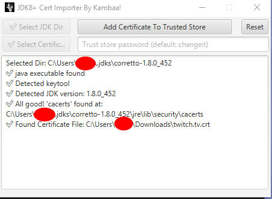

# JDK 8+ Certificate Importer JavaFx Application



In enterprise company environments, you'll need to add the necessary certificates to the JDKs for
connections to work.
Rather than remembering the `keytool` command, i've decided to write this mini JavaFx application to
quickly add the certs to the truststore.

Just select the JDK(JAVA_HOME) folder and certificate and voila! cert is added to the JDK's trust
store. You can also get the certificate contents of given host, or check if given JDK is trusting
the certificate of the given host correctly.

This tool works with every JDK version starting with JDK 8.

This was a nice JavaFx learning experience for me.

## Build Steps

Project(especially JavaFx) needs JDK 21. Make sure your JAVA_HOME and working JDK is the same and
it's JDK 21(otherwise maven command below will not work)

For ease of use, necessary maven executions are placed in maven packaging phase by the operating
system(Linux and Windows). On project's directory, just run

```
./mvnw clean package
```

after successful operation, you should see your executable file in
`<PROJECT_DIR>/target/JDK8+ CertImporter` directory.

For manual operations:

```
# to run the project directly:
./mvnw clean javafx:run

# to generate native executables for the project:
./mvnw clean javafx:jlink
```

### Packaging with jpackage:

Windows:

```
jpackage  --dest target/ --runtime-image target/app --name "JDK8+ CertImporter" --module io.github.kambaa.javafxdemo/io.github.kambaa.javafxdemo.JavaFxApplication --type app-image --icon src/main/resources/app.ico 
```

add `--win-console` to the jpackage to display command line when running (to debug)

check and run `/target/JDK8+ CertImporter/JDK8+ CertImporter.exe`

Linux:

```
 jpackage --dest target --runtime-image target/app --name "JDK8+ CertImporter" --module io.github.kambaa.javafxdemo/io.github.kambaa.javafxdemo.JavaFxApplication --type app-image --icon src/main/resources/icon.png
```

check and run  `/target/JDK8+ CertImporter/bin/JDK8+ CertImporter`

### Todo:

Single file executable generation. Maybe 7zip sfx for windows(?), appimage for linux.

Some links:

- generate portable, single-file running apps for
  linux: https://www.booleanworld.com/creating-linux-apps-run-anywhere-appimage/

